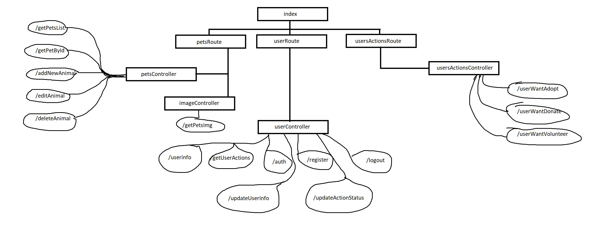

# Как тут всё устроено и как оно работает

## Сервер (`/server`)

В папке можно наблюдать несколько папок и файлов:

| \
|-- ./node_modules \
|-- /src \
|-- .gitignore \
|-- package-lock.json \
|-- package.json 

Последние три файла они повторяются в нескольких местах, но суть не меняется - они содержат данные, на которые гиту не нужно смотреть (`.gitignore`) и данные об используемых зависимостях (установленных модулях) для данного проекта (а ну и немного метаданых, но это не так важно в нашем случае). 

Ещё папочка `node_modules` повторяется, она как раз содержит у себя внутри зависимости необходимые для работы приложения.

Едем внутрь `src`.

### **`index.js`**
Всё начинается с файла `index.js`. В нём происходит инциализация и запуск сервера. Сервер написан с помощью библиотеки `express`. Под инициализацие подразумевается указание на то что сервер использует политику CORS, будет парсить cookie запросов, а также принимать json (размером до 50 Мб). После описание основных путей (route) и имеется указание о том, что для при попытке получить ответ по не существующему роуту, будет ответ 404 с текстом 'Not Found'. Ну и также указание о том, что сервер поднимается локально на порту 5000.

### **`.env`**
Рядом с файлом `index.js` лежит файл с таким прикольным названием. Это переменные окружения в них как правило кладут строки для соединения (connection strings) с БД и прочие параметры, которые не надо выносить в общий доступ. В нашем случае используем для хранения коннекшен стринг для соединения с монгой. Плюсы использования такого подхода в том, что данные и переменные отсюда можно достать из любой точки программы.

### **`/src/routes`**
Если посмотреть `index.js` то там нет как таковых контроллеров, обрабатывающих приходящие запросы, а только лишь отдельные роуты, при том импротированные из файлов лежащих в данной папке. Каждый роут подтягивает отдельно контроллеры для каждой конечной точки (end-point). `petsRoute` немного отличается от остальных, так как с помощью одного из его контроллеров должно загружается изображение, поэтому в нём используется модуль [`multer`](https://expressjs.com/en/resources/middleware/multer.html), описание и подключение которого можно наблюдать. Инициализация этого модуля лишь содержит указание того, куда записывать файл и с каким названием. Остальные роуты в этом не нуждаются поэтому их содержание более простое.

### **`/src/controllers`**
Вот и наши контроллеры, которые описывают логику работы сервера, о том как реагировать при запросе на конкрентный эндпоинт. \
В основном каждый отдельный эндпоинт - это функция и каждая из них имеет близкую структуру:

Спарсить данные (если необходимо) по типу `id` или токен из кукисов + проверить их корректность \
|| \
V \
Подключиться к БД и при необходимости проверить пользователя, который делает запрос (проверка идёт через токен доступа, типо кому принадлежит токен) \
|| \
V \
Выполнить действие (например отсортированный список животных `getPetsList` из `petsController.js`) \
|| \
V \
Закрыть соединение с БД \
|| \
V \
Отправить ответ пользователю

В случае неудачи или чего-то подобного, сервер отправляет соответстующий ответ (к примеру user попробует изменить даннын другого пользователя. Он получет 403 так как это не его данные).

В некоторых контроллерах также имеются дополнительные функции, которые нигде кроме как тут не используются (по типу генерация хэша в `userController.js`)

### **`/src/models`**
Вероятно в оригинальной трактации метода [MVC](https://doka.guide/tools/architecture-mvc/) имелось ввиду другое использование, ну чтож. \
В данном случае я использовал файлы, лежащие там как модели, согласно которым будут выдаваться данные после запросов к монге. [Вот тут подробнее можно почитать (заголовок: `Оператор $project)`](https://habr.com/ru/articles/139643/) 

### **`/src/assets`**
Здесь хранятся картинки животных.

### **`/src/data`**
Импровизированные "бекапы" данных из БД.

### Вот так примерно выглядит архитектура сервера (ну типо кто к кому привязывается и тд)


## БД

И так база данных у нас исполнена на mongo, так как с ней крайне легко и просто работать в условиях сервера на `node`, а также её функционала будет более чем достаточно для наших желаний. Вероятно можно было бы использовать более легкие БД, но в данном случае пришлось бы использовать [ORM](https://developer.mozilla.org/ru/docs/Learn_web_development/Extensions/Server-side/Express_Nodejs/mongoose#%D0%BE%D0%B1%D0%B7%D0%BE%D1%80).

Рассмотрим отдельные базы.

### **`pets`**
Данная БД содержит только лишь коллекцию `petsCollection`. Структура документа примерно такая:

```
{
  "_id": {
    "$oid": string
  },
  "breed": string,
  "age": number,
  "features": string,
  "img": string,
  "illness": string,
  "status": string,
  "animalName": string,
  "animalType": string
}
```
Все названия полей говорящие за себя, объясню только поле `img`. В нём хранится относительный путь до файла с изображением. Это сделано для того, чтобы не увеличивать размер каждого документа в случае например хранения base64 строки.

### **`user`**
Здесь уже находится 2 коллекции. Коллекция `users` хранит данные о каждом пользователе. Структура документа:

```
{
  "_id": {
    "$oid": string
  },
  "userName": string,
  "userRole": string,
  "password": string,
  "token": string,
  "salt": string,
  "city": "string,
  "email": string,
  "phone": string
}
```
Аналогичная ситуация про название полей, поясню только `token` и `salt`. Итак поле `token` оно хранит формирующийся токен доступа для каждого пользователя после авторизации, затем с каждым запросом, в котором необходимо "подтверждение личности" он проверется.

Генерируется он вот так:
```
generateHash(userFromDB.at(0).password + Math.random().toString() + userFromDB.at(0).salt)
```

Т.е происходит генерация хэша из результата конкатенации пароля пользователя, случайного числа и того самого значения из поля `salt`

### **`usersActions`**
Здесь хранятся все документы о заявках пользователей. Структура вот такая (поля отмеченные `?` присутствуют не во всех документах)
```
{
  "_id": {
    "$oid": string
  },
  "action": "string,
  "name": string,
  "phone": string,
  "email": string,
  "comment"?: string,
  "donateSize"?: string,
  "animalType"?: string,
  "status": string
}
```

## Клиент (`/animal-shelter`)

Тут содержимое папки уже знакомое, только появилась папка `public`. В ней содержится файлик `index.html` и подгрузка скриптов для клиента. Можно сказать, что в целом приложение на React привязывается к одному элементу с `id = root`.

[Вот тут подробнее про то как React работает](https://react.dev/learn)

Погнали в `/src`

### **`/src/index.tsx`**

Вот тут как раз происходит инициализация всего приложения и подвязывание, о котором я уже говорил выше.

### **`/src/App.tsx`**

Этот файлик уже начинает содержать сновную логику приложения. Я не буду описывать прям всё, опишу в основном то какие инструменты использовались помимо основного функционала.

[`react-router`](https://ru.hexlet.io/blog/posts/react-router-v6) - штучка нужная для маршрутизации и перехода по страницам, грубо говоря позволяет говорить приложению, что отрисовывать и как реагировать, если в url один или другой.

[`react-context`](https://habr.com/ru/articles/745162/) - чтобы не прогитывать через миллион компонент какие либо параметры используется данная вещь. Она позволяет выносить в глобальный доступ какие-либо данные. За счёт этого они доступны почти в любой точке программы.

Прочий функционал он уже нахдится в react по умолчанию.

### **`/src/components`**

В данной папочке содержатся отдельной прописанные компоненты, которые переиспользуются в нескольких местах, а также содержат инкапсулированную логику.

### **`/src/pages`**

Здесь как раз лежат наши страницы (которые по сути теже компоненты, просто именно их мы отдаём `react-router`-у, что тот отрисовал их при определённом url). Здесь как и в папке `componets` нет отдельно файлов `*.tsx`, а лежат папки. Это таков подход, когда отдельная компонента лежит в отдельной папке и рядом с ней лежит ЕЁ файл со стилями, что позволяет не запутаться к чертям где какой стиль лежит (ну да и чтобы цвет кнопки быстрее менять, потому что ты понимаешь у кого конкретно он какой)

### **`/src/shared`**

Здесь хранятся функции, файлы и прочее, что может приготиться в любом файле.

- Папка `assets` содержит картинки и иконки.
- Папка `container` содержит инциализацию контейнеров для `react-context`.
- Папка `OpenApi` содержит классы для взаимодействия с сервером. Каждый из классов содержит вынесенную в него логику по взаимодействию с той или иной частью API сервера. Вся логика формирования и обрабатывания запросов вынесена в отдельные функции. Помимо прочего каждый из классов наследуется от класса `BaseApi`, что позволяет вынести в него часть общих моментов.
- Папка `utils` содержит функции "утилиты", которые могут понадобится в любом местеи для удобства вынесены сюда (например функция валидации поля через RegExp).
- Файл `DataTypes.ts` содержит описание типов данных, для удоства работы в усолвиях TypeScript.


\
\
Ещё пара слов о клиентской части. На случай если спросят использовал ли ты препроцессоры для css, то нет ([подробнее тут о том, что это такое](https://developer.mozilla.org/en-US/docs/Glossary/CSS_preprocessor)). Однако ты можешь сказать, что не везде но придерживался правила именования классов элементов БЭМ ([вот тут тык](https://ru.bem.info/methodology/html/)).